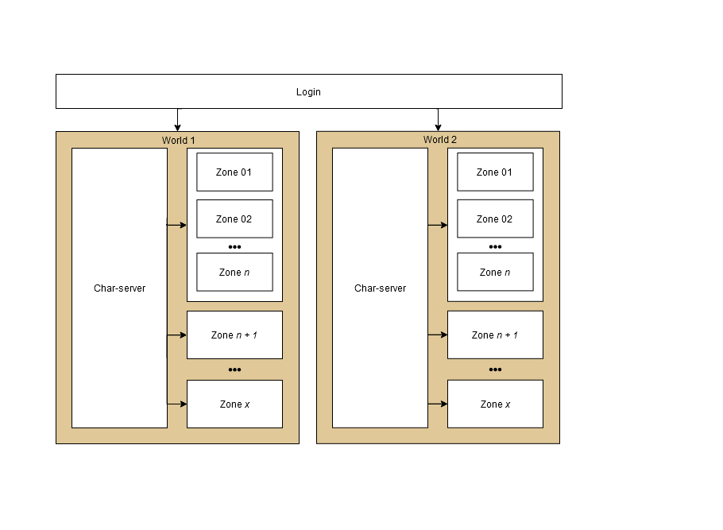
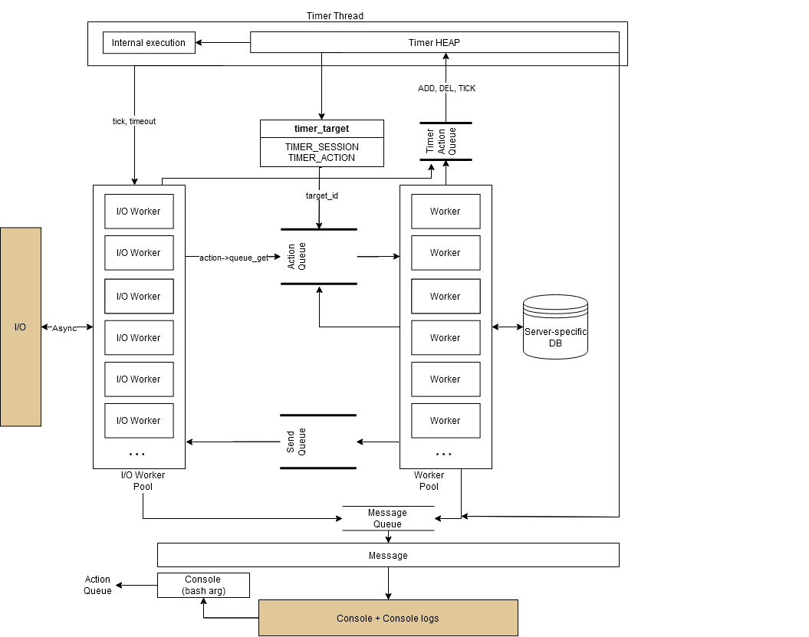

# Server design

Hercules employs a multi-server approach in order to better load balance player requests, so for each game world there'll be at least three separate program instances running at all times. These instrances are: [`login-server`](.src/login), [`char-server`](.src/char) and [`map-server`](.src/map). Each of which can only access a subset of the world's [SQL tables](./sql-files) and is responsible for a different step of the game experience.
Authentication and account database changes are segregated to the login-server, while character selection and character specific information are to the char-server, and the actual gameplay to the map-server.

The login-server is the player entry-point and can be responsible for multiple different world instances, so it's possible to use the same account table (`login`) for multiple *worlds* (char-server + map-server) and to dynamically change their IP without needing to push a new patch. After authentication the player is queried for which service they'll use and then the server relays the proper address so the client can connect.

In the char-server the player usually is queried again for a four digit PIN (`PACKETVER >= 20180124`), after which they can select which playable character will be used to play. The server then relays the address of the proper map-server to the client.

A single world instance can have multiple map-servers where each is responsible for a *zone* (set of maps), all inter map connectivity is managed by the char-server. When the player requests to change character the char-server IP is then relayed.
A single map-server can be responsible for multiple different zones, and each will be a different thread.

|
| - |
| Brown - Game world
| White - program instances

# Core design

All servers are multi-threaded. Basic server functions are assigned to different threads:
- [**Console**](../src/common/console.c):
This thread is responsible for all console input operations.
- [**Timer**](../src/common/timer.c):
The timer thread manages the `timer_heap` and dequeues timer actions from the `timer_queue`. Each timer can be ran in a different thread depending on the `timer_target`, this is accomplished by either queuing an action in one of the available action queues (`target_id`) or by running the specified function in the main timer loop (`do_timer`).
Other threads queue different timer actions (add, delete, set tick) to the `timer_queue`.
The timer module is also responsible for tick acquiral via (`timer->gettick` and `timer->gettick_nocache`).
- [**Message**](../src/common/showmsg.c):
The message thread is used to synchronize the output of multiple different threads, each call to `Show*` instead of being directly outputted to `STDOUT` is queued in the `showmsg_queue` and then dequeued by the main thread function `showmsg_worker`.
- [**I/O Worker**](../src/common/socket.c):
All I/O operations are asynchronous and implemented via I/O completion ports and a thread pool. The main workers are defined in `socket_worker` and after a operation is dequeued it's converted into an action (`socket_operation_process`) that is then queued to the proper action worker (each session has a responsible worker, and it's obtained by the I/O worker via `action->queue_get`).
These workers don't execute any "business logic" so we can minimize the time that they are blocked by any given operation, and also so we can better isolate different session groups without having to take into account in I/O operations (e.g. in map-server each zone has a different action worker and multiple actions can be queued simultaneously without having to block any of the threads for a longer period of time).
- [**Action Worker**](../src/common/action.c):
Action workers perform all the "business logic" of each of the servers, and each is responsible for a different session group. After every action loop all send actions are queued to the completion port.
  - Login-server:
Each char-server connection has a different worker. Player connections are randomly assigned.
  - Char-server:
Each map-server connection has a different worker. Player connections are randomly assigned.
  - Map-server:
Player connections are assigned depending on the current map according to the different configured zones. The char-server connection is randomly assigned.

